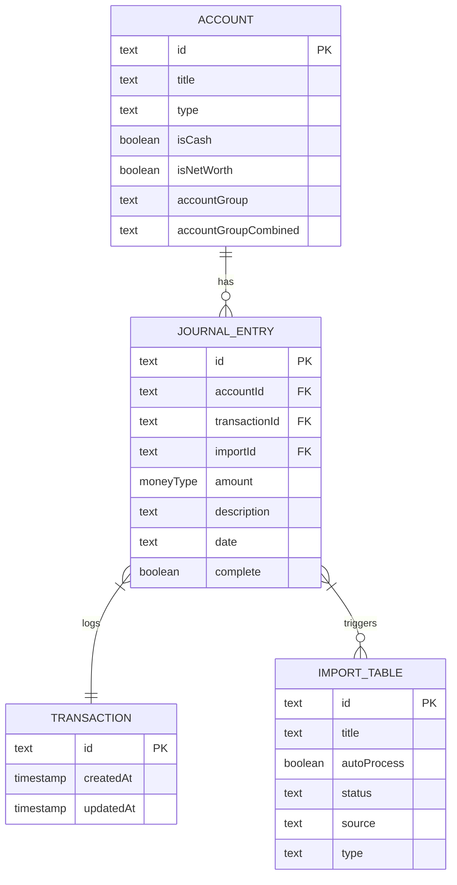

# Database 🚧

::: warning
Work In Progress
:::

```mermaid
erDiagram
    ACCOUNT {
        text id "PK"
        text title
        text type
        boolean isCash
        boolean isNetWorth
        text accountGroup
        text accountGroupCombined
    }
    JOURNAL_ENTRY {
        text id "PK"
        text accountId "FK"
        text transactionId "FK"
        text importId "FK"
        moneyType amount
        text description
        text date
        boolean complete
    }
    TRANSACTION {
        text id "PK"
        timestamp createdAt
        timestamp updatedAt
    }
    IMPORT_TABLE {
        text id "PK"
        text title
        boolean autoProcess
        text status
        text source
        text type
    }

    ACCOUNT ||--o{ JOURNAL_ENTRY : has
    JOURNAL_ENTRY }|--|| TRANSACTION : logs
    JOURNAL_ENTRY }|--o{ IMPORT_TABLE : triggers
```
